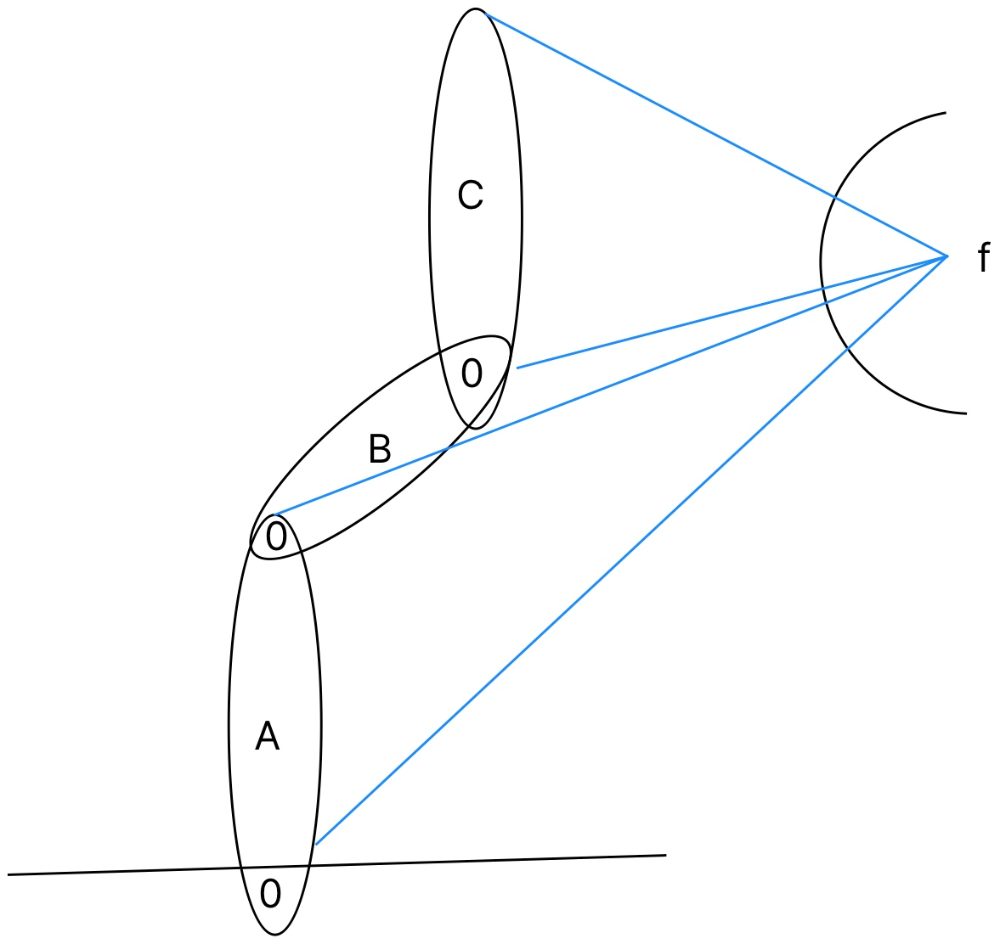
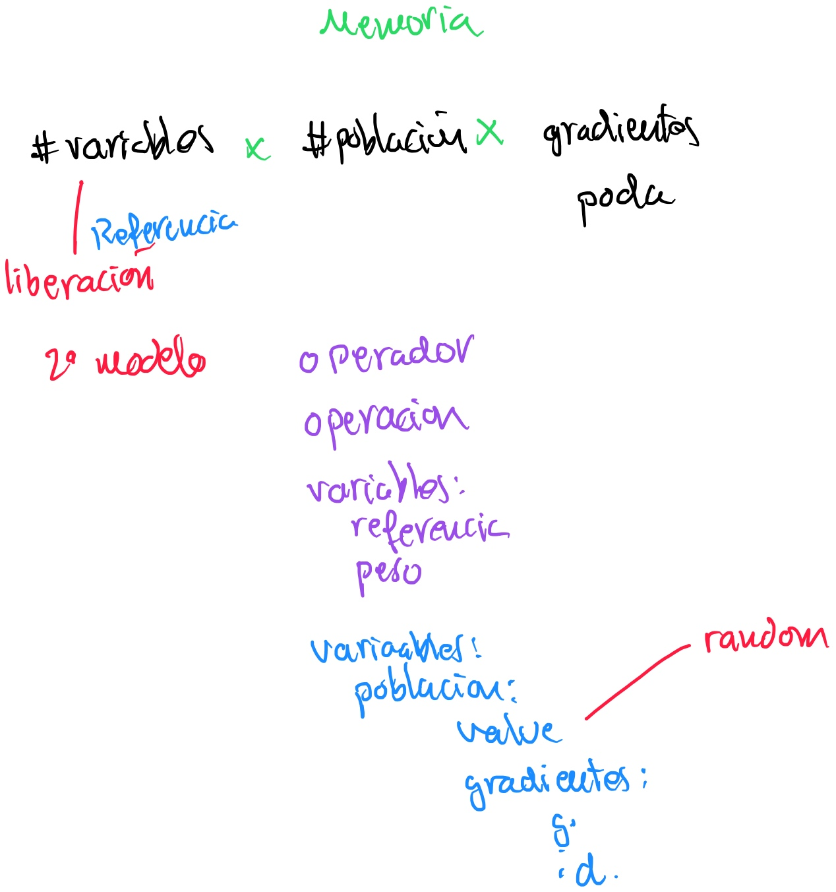
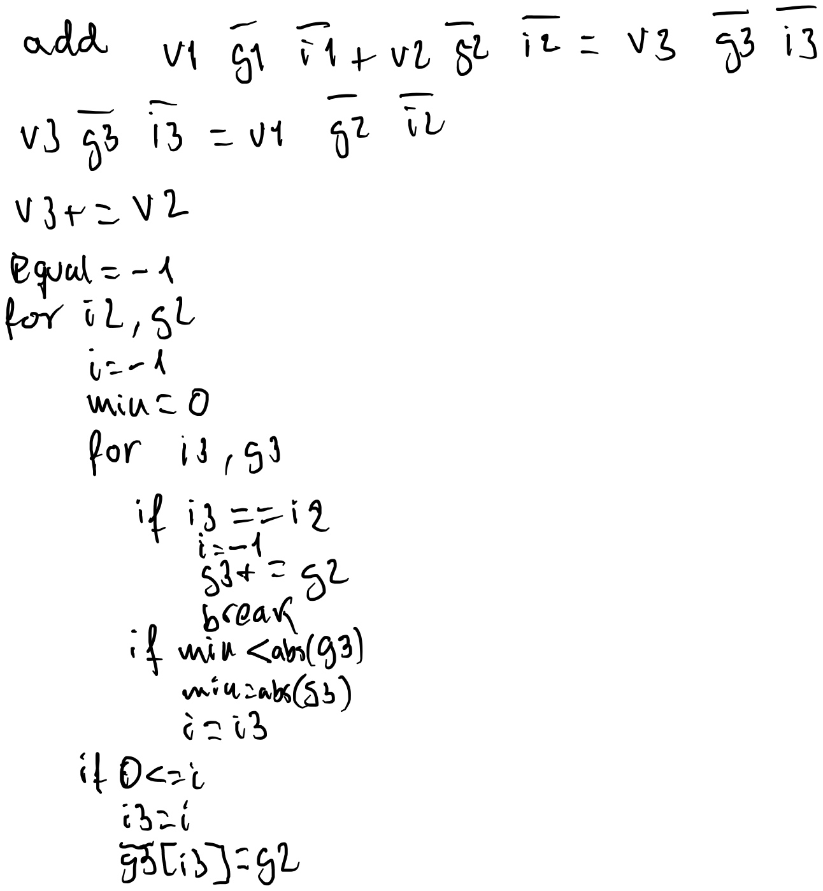
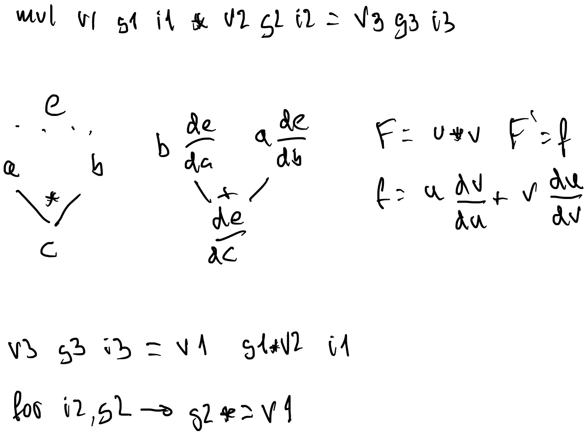

# Calibración Dinámica Robot a partir de Cámaras
# Abstract
Se presenta una técnica novedosa que combina algoritmos genéticos y redes neuronales y es especialmente útil para la definición de modelos. En concreto para el ajuste de los parámetros de un modelo.
La novedad consiste en que los parámetros son ajustados tanto por la red neuronal como por el operador de cruce genético.
Se aplica a un problema robótico, la cinemática inversa, en concreto se usa un modelo físico para ajustar el movimiento y la técnica descrita para hallar los parámetros del modelo. Es una aportación que permite calibrar los parámetros de la cinemática a partir de una cámara.
Se realiza una implementación en CUDA.
La técnica es ideal para modelizar.
Este trabajo combina autodiferenciación, matrices de transformación afines, el modo forward, una técnica que combina algoritmos genéticos con descenso de gradiente para hallar los parámetros de la cinemática inversa de un brázo robótico mediante el ajuste de una cámara en un entorno simulado.
La población se utiliza para probar distintas semillas para los parámetros iniciales. El descenso de gradiente se emplea para el ajuste de los pesos, como si de una red neuronal se tratase. 
Se realiza una implementación usando GPU y proporciona una librería. La autodiferenciación facilita el definir distintos modelos físcos.
Esperamos que el modelado de problemas físicos y su calibración sea mas sencillo su diseño.
Estado del Arte
La neuroevolución combina redes
neuronales con algoritmos genéticos.
Aunque habitualmente el algoritmo genético se utiliza para optimizar la arquitectura de la red neuronal, capas, número de neuronas.
https://ekoizpen-zientifikoa.ehu.eus/documentos/5eccf5c129995207b7db4a96
Algunos trabajos, en conducción autónoma usan el algoritmo genético para cambiar directamente el peso de las neuronas, sin gradientes.
Hay trabajos en los que se usan programación genética diferencial. Estos modelos tratan de optimizar una función y sus parámetros. En nuestro trabajo el grafo de operaciones se supone dado por las descripción física del problema. Y la población genética contiene una población 
Por otro lado en las Physics-Informed Neural Networks (PINN) se incorporan leyes físicas descritas por ecuaciones diferenciales parciales (PDE) directamente entre las capas neuronales.
Son apropiados cuando los datos son escasos y apropiados en simulación de problemas mecánicos.
El aprendizaje profundo se caracteriza por emplear muchas variables o pesos.
La PINN suele ceñirse a un número de capas o bloque, no se ha trabajado la idea de una red PINN 100%, salvo en problemas de dinámica. Una de las características que podría hacer este enfoque es que el número de variables sea menor.
Habitualmente se utiliza el modo reverse o la backpropagation, para ajustar el peso de las variables. Sin embargo es bien conocido que cuando el número de variables es bajo,  método forward es más apropiado.
El algoritmo genético se ha visto siempre como una alternativa a los métodos de descenso de gradientes. Ya que no presenta los problemas clásicos de estancamiento en mínimos locales.
Es bien sabido que una función puede tener varios mínimos locales y que el descenso de gradiente puede depender de la semilla inicial para asegurar la convergencia.
En este trabajo se utiliza la población como semilla. De un proceso físico. 
Se realiza una simulación y se ajustan los parámetros de la simulación.
Se halla un modelo y se oculta, mago de oz, el sistema ha de tener la capacidad de ajustar los parámetros.
¿Por qué un problema simulado? El objetivo del paper es demostrar que la técnica funciona y converge. En un problema real sería muy difícil demostrar que la convergencia alcanzada es la ideal. Por lo que se ha optado por un par de ejemplos simulados.
En el primero, con fines ilustrativos, se emplea un autómata celular, con unos vehículos que se mueven por un ..
En el segundo se incorporan dos aportaciones, uno que el empleo de la Jacobiana y la calibración de … por primera vez. 

# Introducción
## Introducción al problema 
Dado un brazo robótico, del que se desconocen las dimensiones y posición inicial de los segmentos A, B, C. Se tiene una cámara ideal con un punto de foco f y se conocen las proyecciones de todos los segmentos. El problema se trata de realizar rotaciones en los segmentos y a través de la perspectiva deducir la dimensión de los segmentos así como su posición. 
Por fines ilustrativo se presenta el problema en 2D, siendo similar su resolución en 3D.

0

## Introducción a la herramienta de deducción

¿Cuántas variables tener? Podemos fijar la memoria que se quiere consumir y sobre ella determinar la población en función de las capacidades de concurrencia, por ejemplo número de nucleos cuda o DS. El número de gradientes a usar se fijaría según la precisión del problema haciendo varios experimentos. En el caso de escribir en una referencia el programa dejará de funcionar. No sabremos nunca cuando una determinada variable se deja de referenciar, pero una filosofía de caché que reusara las que no se han usado hace mucho tiempo puede servir.
Idealmente para que la caché funcione es conveniente que la población esté detrás de la variable.
El color morado es que está en CPU y en azul es que está en GPU.
Los randoms se usan los proporcionado por numpy y se cargan mediante copia a GPU.
La gpu es tonta no tiene control de si se ha usado una variable o no.
Se le pasa el operador y los operandos, origenes y destino.
Las de peso no se pierden. 
Se puede usar en cpu una cuenta de referencias o una utilización circular.
En la referencia se guarda el número de operación y se borraría lo que se referenció en la última operación. El uso circular se quitaría este chequeo.
Se utiliza una filosofía RIS, todas las operaciones son con registros. Luego si tenemos que multiplicar por una constante esta sería cargada en un registro.

v1 y v2 son variables de entrada, v3 es el resultado. El algoritmo comienza asignando todos los gradientes de v2 a v3. Se trata de quedarse con los mayores gradientes mas significativos. La suma es una adición de gradientes. Hay que asegurarse que el gradiente no está, en la misma pasada podemos detectar también el mínimo. Si no se encuentra y el nuevo gradiente es suficientemente significativo se asigna. Ser suficientemente significativo significa ser mayor en términos absolutos.

Se detallan solo los cambios que se realizarían en el algoritmo anterior. El algoritmo es prácticamente el mismo salvo que los gradientes son multiplicados con el valor de la otra rama.

# Programación Lógica
Los modelos Hamiltonian Monte Carlos (HMC) son una forma de explorar en una serie temporal el espacio de exploración de una forma no aleatoria (MCMC).
Para ello se modelan las variables del sistema como variables aleatorias que siguen una determinada distribución estadística. 

Es decir, se estudia como:

-> X

Si incluimos la función o programa F. En vez de presuponer una variable aleatoria podemos suponer un programa aleatorio.

-> F -> X

¿Qué es un programa aleatorio?

# Bibliografía
Industrial Robotic: Programming, Simulation and Applications, disponible via Fama us, en el capítulo 14 página 280 incluye una descripción de la lente, 273 para conceptos previos.
