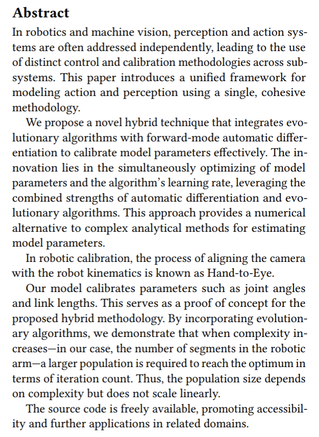
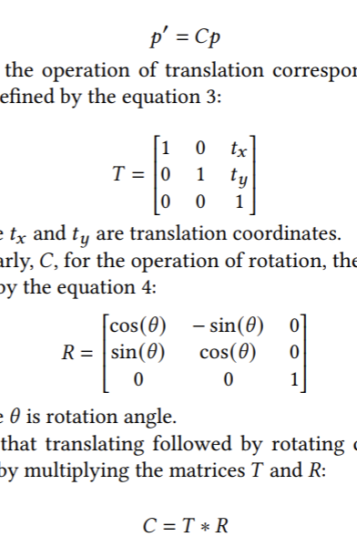
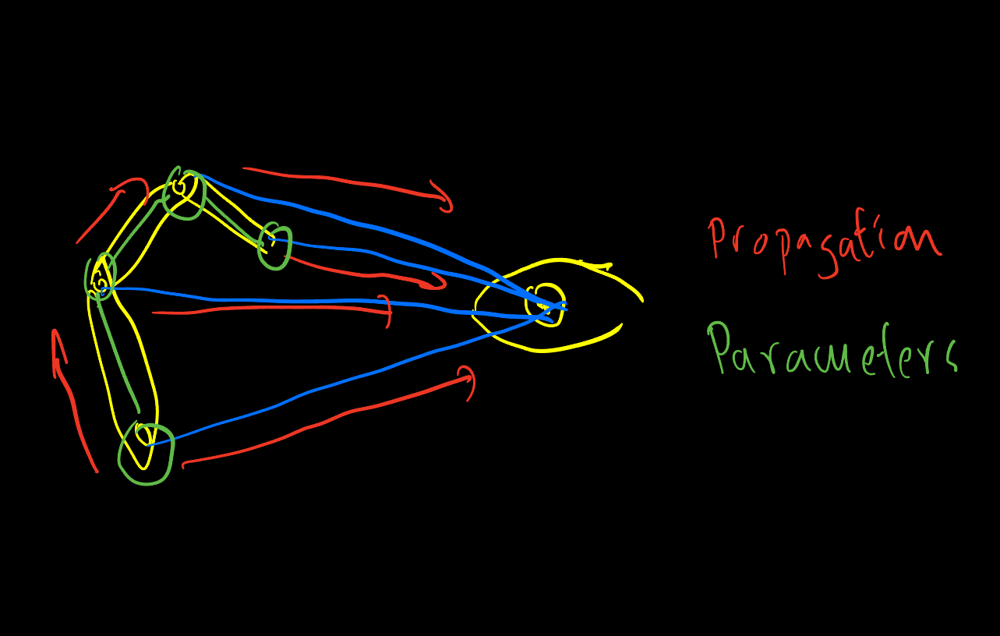
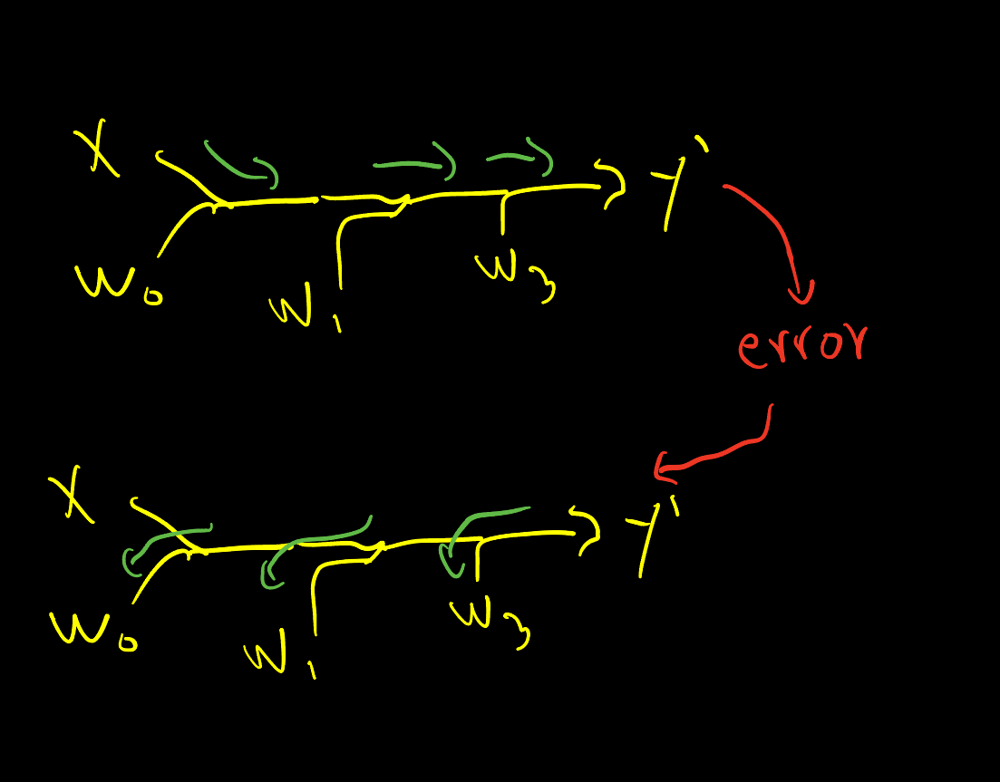
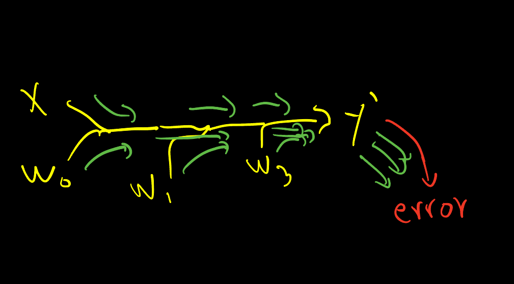
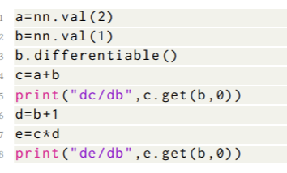
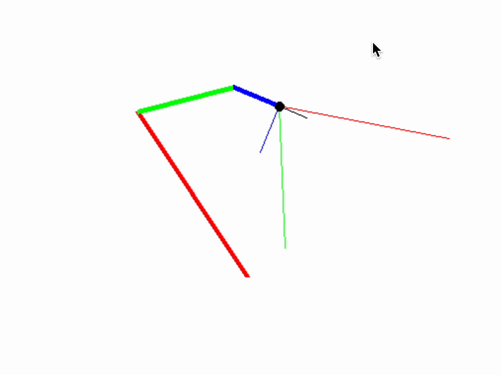
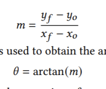
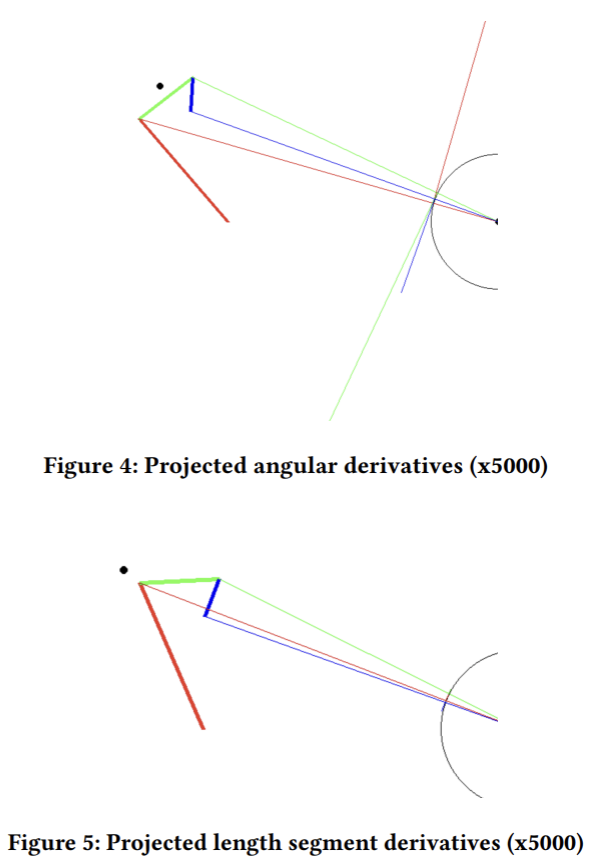
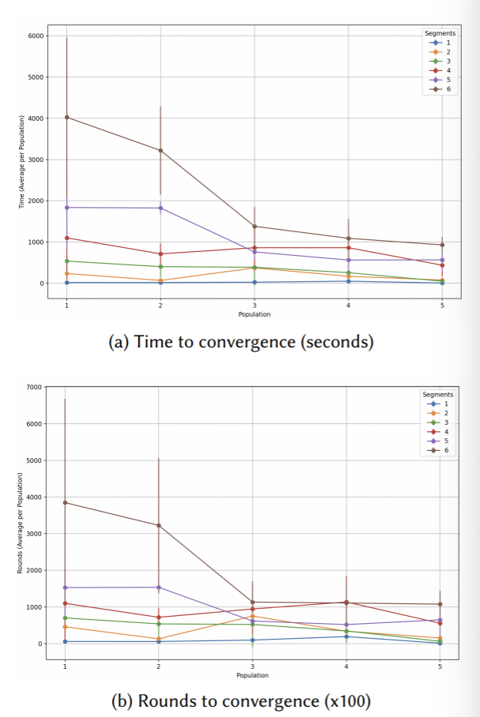

# Eye-to-Hand Alignment in Articulated Robots viea Automatic Differentiation and Genetic Algorithms



* David Ragel Díaz-Jara (dragel@us.es)
* Daniel Cagigas Muñiz
* Maria José Morón Fernandez
* José Luis Guisado Lizar

# Compare Deep Neural Network with GAAD

Genetic Algorithm with Automatic Differentiation.

There is a robotic arm and a camera and a model that tries to converge.
It is a calibration of the kinematics. Length and angle of the segments with a single eye.

Let's compare a deep neural network with a robotic arm.

# Index / Comparison table:

|| DNN | GAAD / Arm |
| ---| --- | --- |
| Parameters | A lot | Few |
| Connected | Fully | HTM |
| Explainability | No | Yes |
| Mode | Backpropagation | Forward |
| Online | No | Yes |
| SGD |Learning rate| Learning rate percentaje|
| Hyperparameter | Learning rate | Genetic population |
| Deploy on device | No | Yes |

# Parameters
## Deep Neural Network a lot

* A neural network receives an input \( x \) and generates an output \( y \). 
* The weights are a tensor, a list of matrices that perform matrix multiplication for each layer, followed by an activation layer.
* I am simplifying by omitting the biases.

## Arm

Parameters = Segments * 2

where each segment has an angle and a segment length.

# Connected  Fully vs HTM 



Homogeneous Transformation Matrix is a matrix used to perform translation and rotation operations in 2D/3D space.

# Explainability
Combining autodifferentiation and HTM, the explainability of GAAD is absolute.

## Connection Hypothesis

* Everything that has a model, has mathematical operations can be connected with gradients.
* The information is the gradient.
* All information propagation, if connected from start to finish, a learning process is allowed.

# Mode
## Backpropagation on DNN

* Two-pass process.
* Need to store the operation graph
* Number operations 7.

## Forward Mode


* The opposite method to backpropagation.
* Number of operations: 13.
* Backpropagation is more efficient but requires two passes.

* FM is the easiest way to program:
    - The derivatives correspond to high school concepts.
    - And using numpy.
    - By overloading Python operators.
* Parallels: Hardware solution.

$$ (uv)' = u'v + uv' $$

```python
self.g[dest, :,:] = (
    self.g[src1, :,:] * self.value[src2, :,np.newaxis] +
    self.g[src2, :,:] * self.value[src1, :,np.newaxis]
)
```

$$ \left( \frac{u}{v} \right)' = \frac{u'v - uv'}{v^2} $$

```python
self.g[dest, :, :] = (
    self.g[src1, :, :] / self.value[src2, :, np.newaxis] -
    (self.value[src1, :, np.newaxis] * self.g[src2, :, :]) /
    (self.value[src2, :, np.newaxis] ** 2)
)
```



Autodifferentiation is syntactic sugar. Performing high-level operations.

# Online / Real Time Learning
## DNN No
First, you train the model, and then you perform inference.

## GAAD Yes
The movement problem does not require learning.
Just project the derivatives onto the hand and perform the dot product.



In the end, we have projected on the tip how each angle affects the movement.

To move from a movement problem to a camera calibration problem, you only need to calculate the slope and the angle.



```python
m=(c.y-focus_cam[1])/(c.x-focus_cam[0])
angle=m.atan()	
```

Using the same mathematics, it consists of two operations.

# Learning rate percentaje
How to apply the gradient
The mystery. Notice how the gradients are.
If we have the correction, we would never extend the segments.



The angular derivative is larger than the length derivative of the segments. This is because one is in pixels and the other is in radians.
This forces us to apply an angular correction smaller than the length correction.
This goes against the philosophy of gradient correction, where the gradient itself is multiplied by the learning rate. Here, the learning rate is proportional.

```python
	def learn(self):
		for peso,id in enumerate(self.nn.peso2id):
			#cte=self.nn.g[self.id2,:,peso]
			cte=self.nn.g[self.id2,:,peso]*np.abs(self.nn.value[id]) 		

			epsilon=self.nn.learning_rate[peso]
			self.nn.value[id]-=epsilon*cte

			self.nn.value[id] = np.where(
				self.nn.valueFrom[id] != self.nn.valueTo[id],
				np.clip(self.nn.value[id], self.nn.valueFrom[id], self.nn.valueTo[id]),
				self.nn.value[id]
			)
```


# Genetic Algorithm


This is a population. The blue one is the reference. The red one is going to die.


With more segments and a larger population
DNN has the learning rate as a hyperparameter.
In GAAD, we have the size of the population as a hyperparameter.

# Gecco Results



The ideal population is three.
Pay attention, with 6 variables and a population of three, we get 6*3=18 parameters to work with.
GAAD is therefore deployable on a small device.


Comparison table:
|| DNN | GAAD / Arm |
| ---| --- | --- |
| Parameters | A lot | Few |
| Connected | Fully | HTM |
| Explainability | No | Yes |
| Mode | Backpropagation | Forward |
| Online | No | Yes |
| SGD |Learning rate| Learning rate percentaje|
| Hyperparameter | Learning rate | Genetic population |
| Deploy on device | No | Yes |

# Future Work

- We plan to extend the model to trajectory 
- Three Dimensional space.
- Mobile Obstacles
