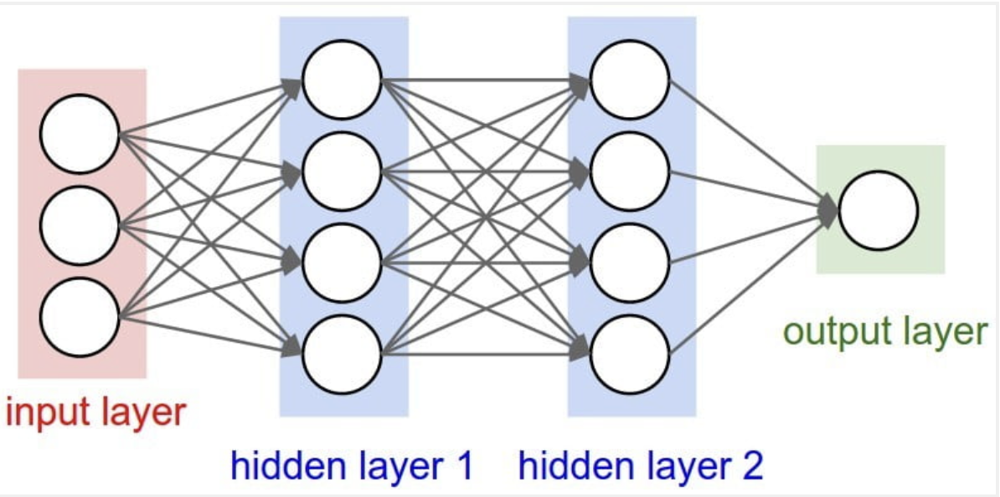
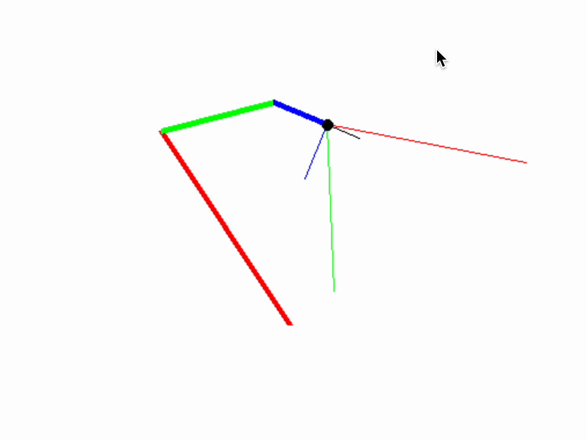

# Who am I
* I am David Ragel. dragel@us.es
* I am a PhD student. 
* I have always try to collaborate but it is difficult.

# Compare Deep Neural Network with Arm Neural with 

# Deep Neural Network

* A neural network receives an input \( x \) and generates an output \( y \). 
* The weights are a tensor, a list of matrices that perform matrix multiplication for each layer, followed by an activation layer.
* I am simplifying by omitting the biases.

# Backpropagation and Learning

* Need to store the operation graph
* Number operations 7.

# Forward Mode

* The oposited method to backpropation.
* Number operations 13
* Backpropagation is more efficient but requires two passes.
* The easiest way to program. 
    - The derivatives correspond to the high school concept.
    - by overloading Python operators.
    - And using numpy.
* Parallels. Hardware solution.

# The movement problem.

    In the end, we have projected on the tip how each angle affects the movement.

# This work helps to understand the transformer
    a projection is made at the output
    And the queries are the route calculations
    there is an exploration.

# The visual problem

    Using the same mathematics, it consists of two operations.
# How to apply the gradient

    The mystery. Notice how the gradients are.
    If we have the correction, we would never extend the segments.

# Genetics
    Genetics adjusts the learning rate.
# Gecco Results
    It is necessary.
    It scales.

# Dynamic pruning
    The data structure.
    If we limit the propagated gradients.
    There are positive results.
Future papers?
I don't know if I should include the vehicles?
# Reinforcement learning
    Two neural networks.
    Not directly connected.
# Chess.
    AlphaZero.
    But it has structure, trick.
# Learning "rules" no.
    Learning the structure. Put black box.
    ID3 / Convolution
    Pseudogradients with typing
    Data collection
# githubs 

# Connection Hypothesis

* Everything that has a model, has mathematical operations can be connected with gradients.
* The information is the gradient.
* All information propagation, if connected from start to finish, a learning process is allowed.
